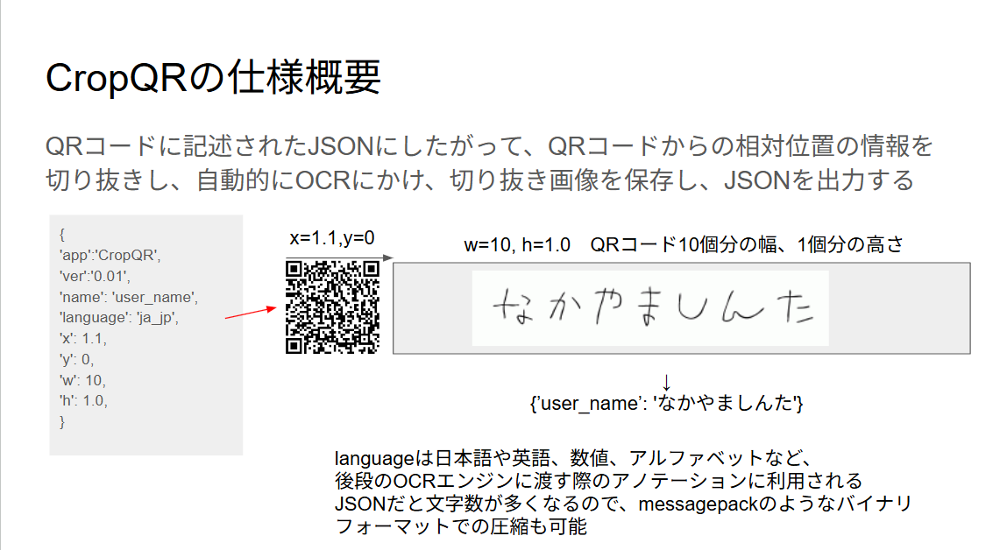

# Qrop QR

## 概要

[コンセプト資料(Google Slide)](https://docs.google.com/presentation/d/1UusCIhZIF972x3nY2aXQVvD0EoTUW-_OT408t3NrU2s/edit?slide%3Did.p#slide%3Did.p)

Qrop QRは、QRコードに含まれた情報から、QRコードに対する相対座標を読み取り、その範囲の領域を切り出してOCRを行うアプリケーションです。

## フォルダ構造

- docs: ドキュメント
- 01_python_proto: Pythonによるプロトタイプ版
- 02_js_demo: JavaScriptによるプロトタイプ版
- 03_csharp_windows: C#によるWindowsアプリ版
- 04_csharp_Android: C#によるAndroidアプリ版
- 05_csharp_thinklet: C#によるiOSアプリ版
