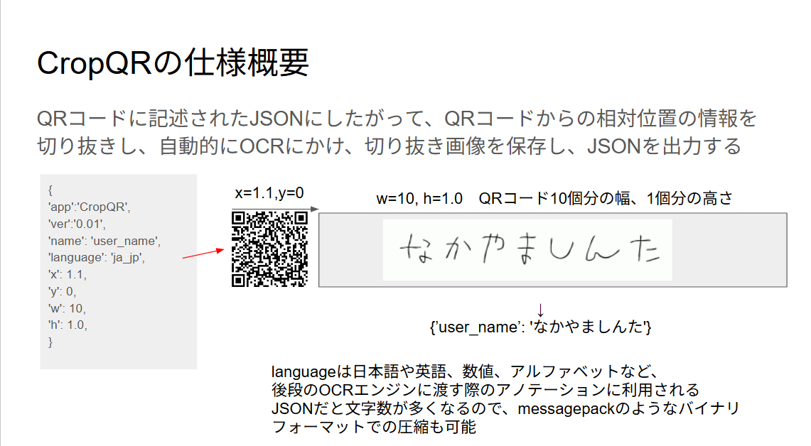
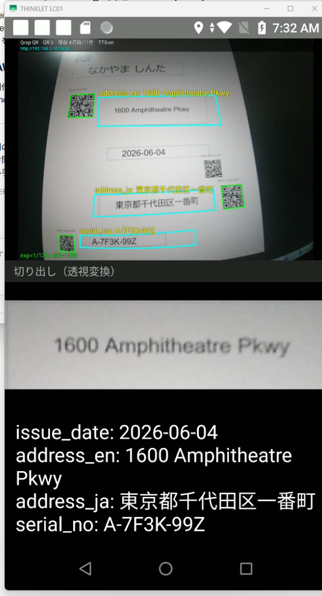

# Qrop QR

Qrop QRは、Connected Worker時代における、新しいOCRソリューションです。

ウェアラブルデバイスを装着した労働者が書類を眺めるだけで、自動的に適切な情報がOCRされ、データベースに格納されていくという未来を目指しています。

## 概要

[コンセプト資料(Google Slide)](https://docs.google.com/presentation/d/1UusCIhZIF972x3nY2aXQVvD0EoTUW-_OT408t3NrU2s/edit?slide%3Did.p#slide%3Did.p)



Qrop QRは、**QRコードに含まれた情報からOCRすべき相対座標を読み取り**、その範囲の領域を透視変換で切り出してOCRを行うアプリケーションです。

書類にあらかじめ「OCR対象フィールドの位置・名前・言語」を記述したQRコードを貼っておけば、装着者がその書類を見るだけで、フィールドが切り出され、OCRされ、（任意で）読み上げ・保存されます。

## 実装

本リポジトリは、Fairy Devices社のウェアラブル端末 **THINKLET (LC01)** 向けの **Kotlin / Android ネイティブ実装** です。

THINKLETは **Google Play Services を持たない** AOSP/Fairy OS 端末のため、QR検出・OCR・TTS・魚眼キャリブはすべて **端末内（オフライン）** で完結させています。

### 機能

- **QR検出 → 相対座標で領域切り出し → OCR**
  - QRに **CQR2 バイナリ形式**（固定10Bヘッダ＋末尾name、座標は12bit固定小数Q8.4）で id・name・lang・相対座標 `x,y,w,h` を埋め込む（[docs/SPEC.md](docs/SPEC.md)）。テキスト形式より小さく低バージョン化でき、低解像度・ブレに強い。ML Kit `getRawBytes()` で復号
  - QRコードのサイズ（シンボル＝白枠を除く）を1単位とした相対座標でフィールドを定義
  - QRの4隅から `Matrix.setPolyToPoly` で透視変換し、フィールド領域だけを正対画像に切り出してOCR
  - **マルチQR**：フレーム内の全QRを同時処理（1QR=1フィールド）。OCRは1ティック1フィールドのラウンドロビンで軽量に
  - **回転不変**：ファインダパターンでQRシンボルの上方向を判定し、端末/QRを90°・180°回しても
    フィールド位置が破綻しない（ML Kit cornerPoints は画像基準のため、QRごとに軽量なピクセル判定で補正）
- **オフライン OCR**：ML Kit（バンドル版）Text Recognition v2（Latin + Japanese）
- **オフライン QR検出**：ML Kit（バンドル版）Barcode Scanning
- **読み上げ (TTS)**：Fairy Josee（`ai.fd.josee.app.tts`、日英オフライン）で**認識値を読み上げ**（カラム名は読まない＝日本語TTSが英字を1字ずつ読むのを回避。同じ値の連呼も抑制）。未導入時はTTS無効で動作継続
- **端末内HTTPビューア**：OCR結果をブラウザでライブ確認＋蓄積閲覧（依存ライブラリなしの内蔵HTTPサーバ。後述）
- **モーションブラー対策**：Camera2 manual sensor によるアダプティブ高速シャッター
  - 露光時間の上限を **1/62s (`MAX_EXP_NS`)** に固定し、明るさを測りながらブラーを抑えつつ露出を自動調整（QRはブラーに弱いため）
- **3分割UI**：上＝カメラLive＋認識枠（QR=緑 / フィールド=シアン）、中＝切り出した透視変換画像、下＝OCR結果文字列
  - 上部に状態バー（**QR検出数・保存件数・TTS可否・閲覧URL**）を表示し、デモで「どこを見るか」が一目で分かる
- **端末内 魚眼キャリブ**：タッチの無いTHINKLET向けに、**音量↑＋音量↓の同時押し**でキャリブモードへ（再ビルド不要）。チェスボードを複数視点で見せると、**端末内で OpenCV `fisheye.calibrate` を実行**して K,D を推定し `filesDir/calib.json` に永続化（再起動後も自動ロード）。PC不要。詳細は [tools/calib/](tools/calib/)

### 動作画面



実機（THINKLET LC01）で書類を見たときの3分割UI。QRから読み取った相対座標でフィールドを切り出し、日英OCRした結果が下部に並ぶ。

### 動作環境 / ビルド

- 端末: THINKLET LC01（Android 8.1 / API 27, arm64-v8a, GMSなし, 広角カメラ）
- ツールチェイン: AGP 8.10 / Kotlin 2.1 / compileSdk 36 / minSdk 27 / Gradle 8.13 / JDK 21 (JBR)
- ABI: `arm64-v8a` のみ
- 主要依存: ML Kit（バンドル版, GMS非依存）/ CameraX / **OpenCV**（端末内キャリブ用, `org.opencv:opencv`）。OpenCVのネイティブ.soで APK は約56MB（arm64）
- 解析解像度: 2048×1536（4:3）。センサは8MPだがレンズ実効解像力が頭打ちのため、速度と実効品質の最適点として採用

```bash
# ビルド & インストール（adb が通る状態で）
./gradlew :app:assembleDebug
adb install -r -g app/build/outputs/apk/debug/app-debug.apk
```

### デモの流れ

1. `testdata/form_multi.png` を画面表示（または印刷）。`make_multiform.py` で再生成可。
2. アプリを起動し、THINKLET を書類に向ける。上部の状態バーに `QR:N` と**閲覧URL**が表示される。
3. PC/タブレットのブラウザで、状態バーのURL（同一WiFi）か、`adb forward tcp:8080 tcp:8080` 経由の `http://localhost:8080` を開く。
4. 各フィールドが切り出し→OCRされ、「**現在値**」に1行ずつ並び、変化が「**履歴**」に蓄積される（**CSV**で取り出し可）。
5. 日本語フィールドは Josee 導入時に読み上げ（任意）。

### TTS（Josee）について

THINKLET内蔵の Pico TTS (`com.svox.pico`) は `synthesizeText` でネイティブクラッシュするため使えません。
代わりに Fairy製 **Josee**（OpenJTalk[日] + Flite[英]）を利用します。Joseeはリリース配布が無く**ソースからビルド**が必要です（[FairyDevicesRD/droid.josee.tts](https://github.com/FairyDevicesRD/droid.josee.tts), NDK 26.3）。

```bash
adb install -r josee-tts-*.apk
adb shell settings put secure tts_default_synth ai.fd.josee.app.tts
```

### 端末内HTTPビューア

THINKLETには見やすい画面が無いため、OCR結果を外部ブラウザで確認できる軽量HTTPサーバを内蔵しています（ポート `8080`、依存ライブラリなし＝GMS非依存を維持）。画面は **ライブ / 現在値 / 履歴** の3カードで自動更新（~700ms）。

- **ライブ**：最新の切り出し画像＋認識値
- **現在値**：1フィールド1行（OCRが多少ブレても表示は安定）
- **履歴**：値が変わるたび1行追加。**CSVダウンロード**・**クリア**ボタン付き

```bash
# USB接続のみで見る（同一LAN不要）
adb forward tcp:8080 tcp:8080
# → ブラウザで http://localhost:8080

# 同一WiFiのPC/タブレットから見る場合は端末IP（端末の状態バー、または起動ログ "HTTP listening on :8080 -> ..." を参照）
# → http://<端末IP>:8080
```

| エンドポイント | 内容 |
| --- | --- |
| `GET /` | ビューア（ライブ＋現在値＋履歴、自動更新、CSV/クリア） |
| `GET /state.json` | ビュー用JSON（最新値＋現在値＋履歴） |
| `GET /records.json` | 履歴の機械可読JSON（将来のDB連携／外部POSTへの橋渡し） |
| `GET /records.csv` | 履歴のCSVダウンロード |
| `GET /records` | 履歴のスナップショット（サーバ描画・印刷向け） |
| `GET /clear` | 記録を全消去 |
| `GET /crop.jpg` | 最新の切り出し画像（JPEG） |

> 注: 本サーバは**デモ・検証用**の「端末＝サーバ」構成です。本番のConnected Worker構成では「端末＝クライアント→収集サーバ→DB」と逆向きになります。`/records.json` を用意してあるので、その移行（外部エンドポイントへのPOST）は容易です。

### QRコード仕様（CQR2）

各QRには、OCR対象フィールドの定義を **CQR2 バイナリ形式**（固定10Bヘッダ＋末尾UTF-8 name）で埋め込みます。

| off | size | field | 内容 |
| --- | --- | --- | --- |
| 0 | 1 | `ver` | 形式版＝`1`（`rawBytes[0]` を magic 兼用） |
| 1 | 2 | `id` | uint16（DBキー。不要なら0） |
| 3 | 1 | `flags` | bit0-1: 言語（`0`=en, `1`=ja） |
| 4 | 3 | `x,y` | 12bit固定小数 **Q8.4**（実値=raw/16, ±128, 1/16）×2 を3Bにパック |
| 7 | 3 | `w,h` | 同上 |
| 10.. | 可変 | `name` | UTF-8（**末尾＝残り全部**。長さ識別不要） |

- 座標は **QRシンボル（白枠を除く）を1単位**とした相対値（原点=シンボル左上, X軸=幅, Y軸=高さ）。
- ML Kit `getRawBytes()`（バイト透過）で復号。テキスト形式(CSV/JSON)は非対応。
- バイナリ化でQRを低バージョン化でき、低解像度・ブレに強い。
- **完全な仕様・座標図・パック手順・例は [docs/SPEC.md](docs/SPEC.md)** を参照。

### カメラキャリブレーション（魚眼補正）

THINKLETの広角カメラは魚眼気味で、画面端ほど直線が湾曲します。QRの隅からフィールドを透視変換で外挿すると、QRから離れた位置ほどズレるため、レンズの内部パラメータ `K` と歪み係数 `D` を推定して補正します。**端末内で完結**（OpenCV同梱・PC不要）:

1. チェスボードを用意（`tools/calib/gen_chessboard.py`、内側コーナー 9×6）。画面表示でも可（マスを正方形に・グレア回避）。
2. アプリ起動中に **音量↑＋音量↓ 同時押し** でキャリブモード（TTSで案内）。
3. チェスボードを様々な角度・距離・位置で見せる（特にフレーム四隅）。検出のたびTTS「視点 N」。
4. **15視点**で端末内 `Calib3d.fisheye_calibrate` を実行 → 結果を `filesDir/calib.json` に永続化（再起動後も自動ロード）。TTSで完了とRMSを通知。

焼き込み既定値は `Fisheye.kt` の `Calib`。詳細・オフライン手順・モデル式は **[tools/calib/](tools/calib/)**。

### テスト用フォーム

[testdata/](testdata/) にサンプルフォーム（QR＋OCR対象テキスト）があります。

- `form_en.png` … CQR2(`name`,en,x=1.2,w=8,h=1) ＋ "Yamada Taro"
- `form_ja.png` … CQR2(`user_name`,ja,x=1.2,w=8,h=1) ＋ "なかやま しんた"
- `form_multi.png` … **マルチ読み取り（複数QR＝1QR1フィールド）サンプル**。様々な大きさ・オフセット（右/下/左/上, 負値含む）のQR＋読み取り領域を6つ並べたA4縦帳票（`make_multiform.py`）。各QRはCQR2バイナリ。
  各フィールドのダミー値: `INV-2026-0042` / `なかやま しんた` / `1600 Amphitheatre Pkwy` / `2026-06-04` / `東京都千代田区一番町` / `A-7F3K-99Z`

`testdata/make_form.py` ／ `testdata/make_multiform.py` で再生成できます（`pip install qrcode pillow`）。

## ライセンス

[MIT License](LICENSE)。

依存ライブラリ（ML Kit / CameraX / AndroidX 等）は各々のライセンスに従います。TTSの **Josee** は本リポジトリに含みません（別途ビルド・導入。前述）。

## 特許
- 本実装は、富士通が保有していた特許第４３９８４７４号に酷似しています
  - https://www.j-platpat.inpit.go.jp/c1801/PU/JP-4398474/15/ja
  - しかし、当該特許は失効しているため、特許権の侵害はないと考えています

## 履歴

過去の試作（Pythonプロトタイプ / JS・C# 各版）は本リポジトリから整理・削除しました。必要な場合は Git 履歴を参照してください（`Initial commit` 以前のコミット）。
